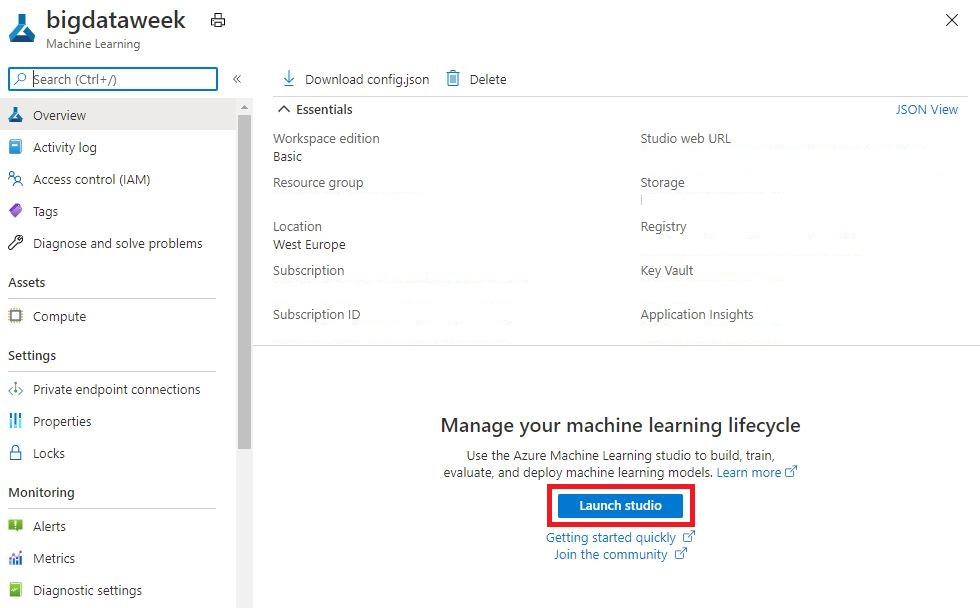

# Setup

## Create a Machine Learning workspace

To create a workspace, you need an Azure subscription. Please refer to the workshop instructions.

1. Sign in to the [Azure portal](https://portal.azure.com/) by using the credentials for your Azure subscription. 

1. In the upper-left corner of Azure portal, select **+ Create a resource**.

      

1. Use the search bar to find **Machine Learning**.

1. Select **Machine Learning**.

1. In the **Machine Learning** pane, select **Create** to begin.

1. Provide the following information to configure your new workspace:

   Field|Description 
   ---|---
   Subscription |Select the Azure subscription that you want to use.
   Resource group | **bigdataweek-workshop-X**
   Workspace name | **bigdataweek**
   Region | **West Europe**

    

1. When you're finished configuring the workspace, select **Review + Create**. 

1. Review the settings and make any additional changes or corrections. When you're satisfied with the settings, select **Create**.

   > NOTE: It can take several minutes to create your workspace in the cloud.

   When the process is finished, a deployment success message appears. 
 
 1. To view the new workspace, select **Go to resource**.

 1. Once you are in the new resource screen, click ** Launch studio** to start the Azure Machine Learning Studio.

    

1. You may get prompted to select the ML workspace you want to connect to. Choose the workspace you created in previous steps.

    
