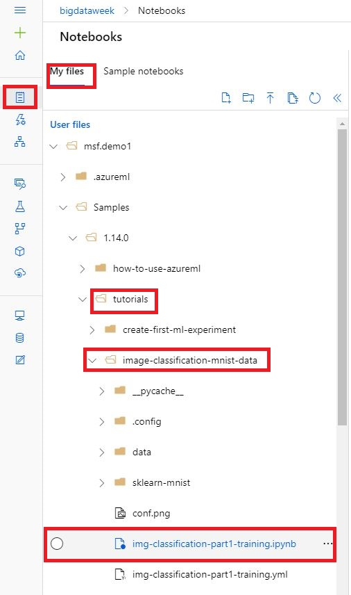

# Train and deploy models with Azure Machine Learning in Jupyter Notebooks

In this tutorial, you complete the steps to get started with the Azure Machine Learning using Jupyter Notebooks on a [managed cloud-based workstation (compute instance)](concept-compute-instance.md). 

In this tutorial, you:

> * Clone the samples notebooks to your folder in the workspace.
> * Create a cloud-based compute instance with Azure Machine Learning Python SDK installed and pre-configured.
> * Train a machine learning model.

### Clone a notebook folder

You complete the following experiment set-up and run steps in Azure Machine Learning studio, a consolidated interface that includes machine learning tools to perform data science scenarios for data science practitioners of all skill levels.

1. Sign in to [Azure Machine Learning studio](https://ml.azure.com/).

1. Select your subscription and the workspace you created.

1. Select **Notebooks** on the left.

1. Select the **Sample notebooks** tab at the top.

1. Select the **"..."** at the right of the **Samples** folder and then select **Clone**.

    

1. A list of folders displays showing each user who accesses the workspace.  Select your folder to clone the **Samples**  folder there.

### Open the cloned notebook

1. Open the **tutorials** folder that was just closed into your **User files** section.

    > [!IMPORTANT]
    > You can view notebooks in the **samples** folder but you cannot run a notebook from there.  In order to run a notebook, make sure you open the cloned version of the notebook in the **User Files** section.
    

1. Select the **img-classification-part1-training.ipynb** file in your **tutorials/image-classification-mnist-data** folder.

    

1. On the top bar, select a compute instance to use to run the notebook. These VMs are pre-configured with [everything you need to run Azure Machine Learning](concept-compute-instance.md#contents).

1. If no VMs are found, select **+ Add** to create the compute instance VM. 

    

    1. Give it a name, for example **bigdataweekX**

    1.  Select the Virtual Machine size from the available choices. For this workshop please use **DS2_v2**.

    1. Then select **Create**. It can take approximately 5 minutes to set up your VM.

1. Once the VM is available it will be displayed in the top toolbar.  You can now run the notebook either by using **Run all** in the toolbar, or by using **Shift+Enter** in the code cells of the notebook.

If you have custom widgets or prefer using Jupyter/JupyterLab select the **Jupyter** drop down on the far right, then select **Jupyter** or **JupyterLab**. The new browser window will be opened.

## Train a model using AML Compute

Now that you have a development environment set up, continue on to train a model in a Jupyter Notebook.

> NOTE: While running this notebook you may get prompted for interactive authentication. In that case, open the URL as instructed and 

